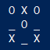

A tiny version of Tic Tac Toe that I made for my Casio calculator.



```python
p=0
g=['_']*9
while 1:
 print(3*'\t\t%s %s %s\n'%(*g,))
 g[int(input())-1]='OX'[p]
 p^=1
```
<sup>☝ Yes, this is all the code, `88b` in total!</sup>

# Explained
It starts off with declaring a variable that keeps track of which **p**layer is playing.
This is required to know wheter to place a `X` or `O`.
It's used as an improvised boolean, but uses an integer because it's syntax is shorter.
```python
p=0
```

Then we create an array storing the data from the **g**rid.
This is done by:

1. Creating an array with a single element. It's the char `_`, this is done because it's the default before an `X` or `O`
2. Multiplying the array with 9, and thus creating an array with 9 `_` chars.

```python
g=['_']*9
```

Creates an infinite loop.
`1` is evaluated as `true` but it's shorter to write.
```python
while 1:
```

## What the `\t\t%s %s %s\n` string template does
- The 2 `\t`' at the start add an indent which centers the grid in the middle of the calculator's screen.
- The 3 `%s`' with spaces seperating them is where the characters from the grid array are placed.
- The `\n` makes sure the output is in the desired square playing field.
## What the multiplying does
The standard template contains 3 places where values can be inserted and is only for the first line of the grid, therefore it's multiplied by 3.
#### Result before:
```
    _ _ _
```
#### Result after:
```
    _ _ _
    _ _ _
    _ _ _
```
## What `%(*g,)` does
`g` is the variable that contains an array for the variables in the playing grid. The `,` turns the array into a tuple. The `*` (decompose) operator turns the tuple in seperate values which the string formatting operator (`%`) uses to insert into the template.
```python
 print(3*'\t\t%s %s %s\n'%(*g,))
```

1. Takes input from the user
2. Converts input to integer
3. Subtracts one so the grid index maps to the calculator's number keys.
4. Sets character in grid array at the index with the integer to either `O` or `X` depending on the player using an array getter on the string.
```python
 g[int(input())-1]='OX'[p]
```

Goes back to the other player
The ixor operator (`^=`) performs an xor assignment that flips between `1` and `0`.
This is used to invert our improvised boolean.
 ```python
 p^=1
```